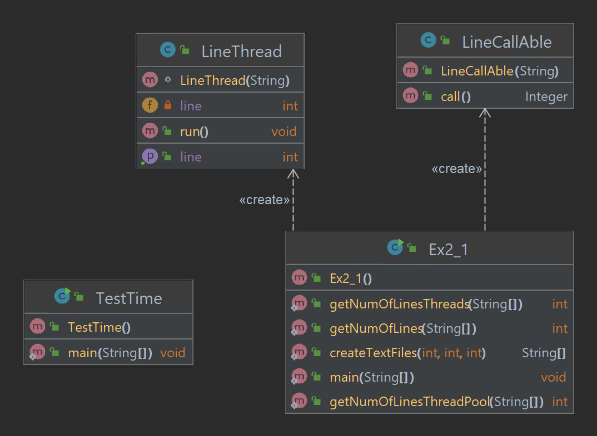

# OOP.Assignment2

- Nevo Gadassi - 325545887S

- Shani Basteker - 311318075

## Part1 - Make file's and count their lines Description
 

### Ex2_1 class

Control the updates of UndoableStringBuilder by observer (design pattern for code).

## GroupAdmin 
we built GroupAdmin class that Contains members and updates them on any changes that happen in the UndoableStringBuilder .

 register- function that writes new member to admin
 
 unregister- function that unregisters the member from the admins list
 
 updatemember -function that updates all the list of members

 
 insert, append, delete, undo-The methods of UndoableStringBuilder
 
 ## ConcreteMember 
This class represent a specific member and his UndoableStringBuilder

update- update member's UndoableStringBuilder to the GroupAdmin one.

## UML:
 

 

Nevo Gadassi and  Shani Basteker

 

